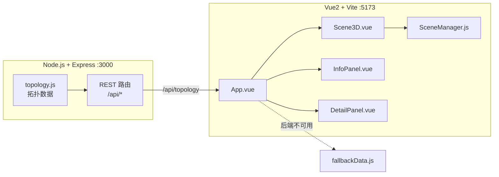

# 架构说明

## 总览

系统采用前后端分离架构。后端是无状态的 REST API，仅提供仿真拓扑数据；
前端负责全部 3D 渲染与交互。

## 数据流

1. `App.vue` 在 `created` 钩子请求 `GET /api/topology`。
2. 成功则使用 API 数据；失败回退到 `services/fallbackData.js`。
3. 拓扑传入 `Scene3D.vue`，由 `SceneManager.setTopology()` 构建 3D 物体。
4. 用户点击 3D 物体 → 射线拾取 → `SceneManager.onSelect` 回调 → `App` 更新
   `selected` → `DetailPanel` 显示详情。
5. 用户点击列表项 → `App.onPick` → `Scene3D.selectById` → 高亮对应 3D 物体。

## 关键模块职责

| 模块                         | 职责                                                       |
| ---------------------------- | ---------------------------------------------------------- |
| `backend/src/data/topology.js` | 拓扑数据唯一来源（模拟器/服务器/连接）                      |
| `backend/src/server.js`        | Express 应用、CORS、REST 路由                              |
| `three/SceneManager.js`        | 渲染器、相机、灯光、控制器、连接线、粒子、标签、拾取、动画 |
| `three/builders.js`            | 按类型构建模拟器与服务器几何体                            |
| `three/textures.js`            | Canvas 程序化生成投影屏纹理                                |
| `components/Scene3D.vue`       | Vue ↔ SceneManager 桥接                                   |
| `components/InfoPanel.vue`     | 左侧设备/连接列表                                          |
| `components/DetailPanel.vue`   | 右侧选中元素详情                                          |

## 可视化参数对照（PRD）

- 背景 / 雾：`#040810`，雾 near 55 / far 130
- 阴影：PCFSoftShadowMap，2048×2048
- 相机缩放范围：8 ~ 85；自动旋转速度 0.28
- 数据粒子：每条连接 2 个，共 6 个，速度 0.006/帧
- 连接线脉冲周期：约 3.5 秒
- DPR 上限：2
